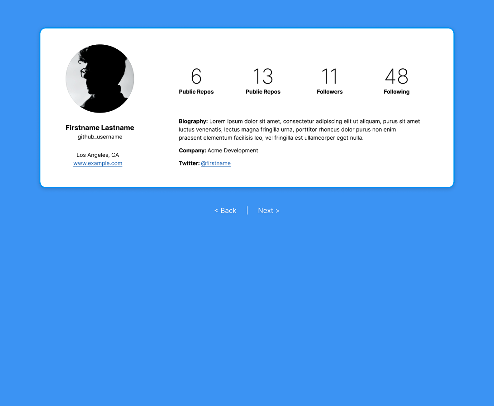

# Interview Coding Challenge

This is a basic [Next.js](https://nextjs.org/) project bootstrapped with [`create-next-app`](https://github.com/vercel/next.js/tree/canary/packages/create-next-app). You have free reign to setup the project in any way you would like. Install as many packages or fonts as you wish. There are no limitations in that regard. The purpose of this exercise is to allow us to get some insight into your coding style, code quality, and organizational skills.

## Getting Started

```bash
npm run dev
# or
yarn dev
```

Open [http://localhost:3000](http://localhost:3000) with your browser to see the result.

You can start editing the project by modifying `pages/index.js` and `pages/profile.js`. The page auto-updates as you edit the file.

## Objective

The goal of this assessment is to determine how well you're able to ingest API data and turn it into a working web app.

To begin, you'll want to get familiar with the [Github Users API](https://docs.github.com/en/rest/users/users#get-a-user). It is a free and publicly available API which allows users to request publicly available Github user data. It does not require authentication to use.

Your objective in this challenge is to create a navigable, fully-responsive list of Github users in the browser with the visual treatment represented below:

### Homepage


### Profile Page



# Notes

Since this project is bootstrapped with [Next.js](https://nextjs.org/), you will have access to basic components such as the `Image` and `Link` components. You'll likely want to use those in this challenge.

We do not assume you know Next.js but we do assume you understand how routing works. You will want to get familiar with the way Next.js handles routes. More on that can be found in the [routing docs](https://nextjs.org/docs/routing/introduction).

Good luck and happy coding!

## Timeline

How long should this take? Roughly 1 to 2 hours depending on how involved you choose to make it.

## More About Next.js

To learn more about Next.js, take a look at the following resources:

- [Next.js Documentation](https://nextjs.org/docs) - learn about Next.js features and API.
- [Learn Next.js](https://nextjs.org/learn) - an interactive Next.js tutorial.

## Bonus Points

Use Typescript. Use SASS and CSS modules. Add tests.
